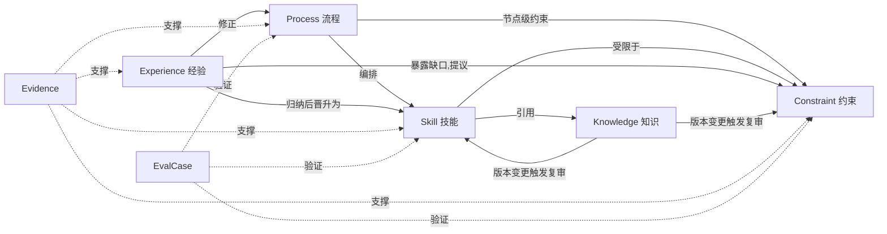
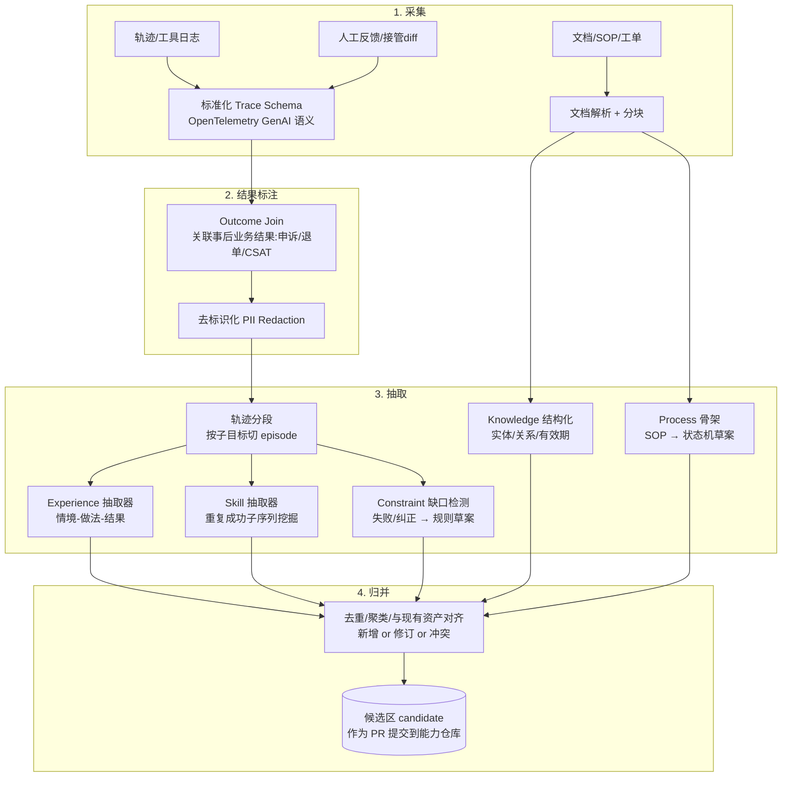
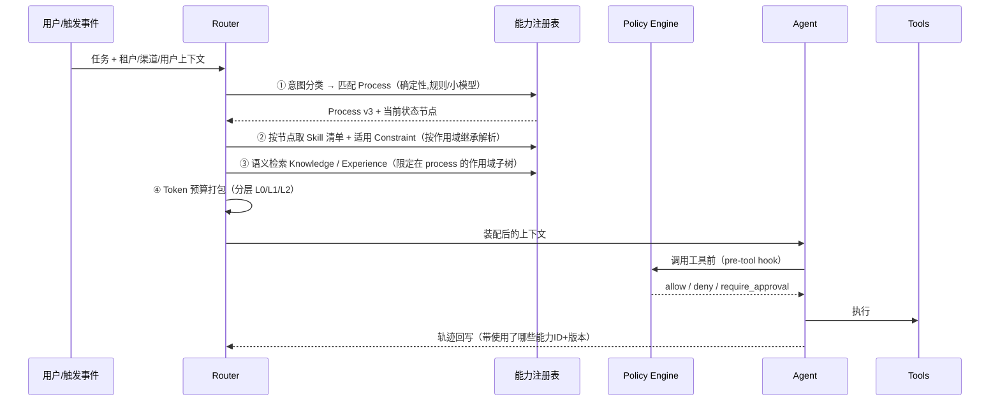
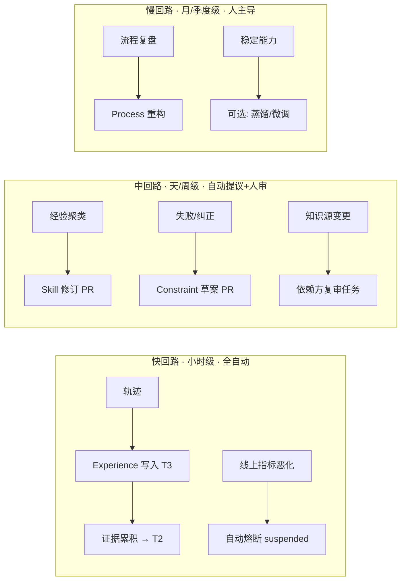
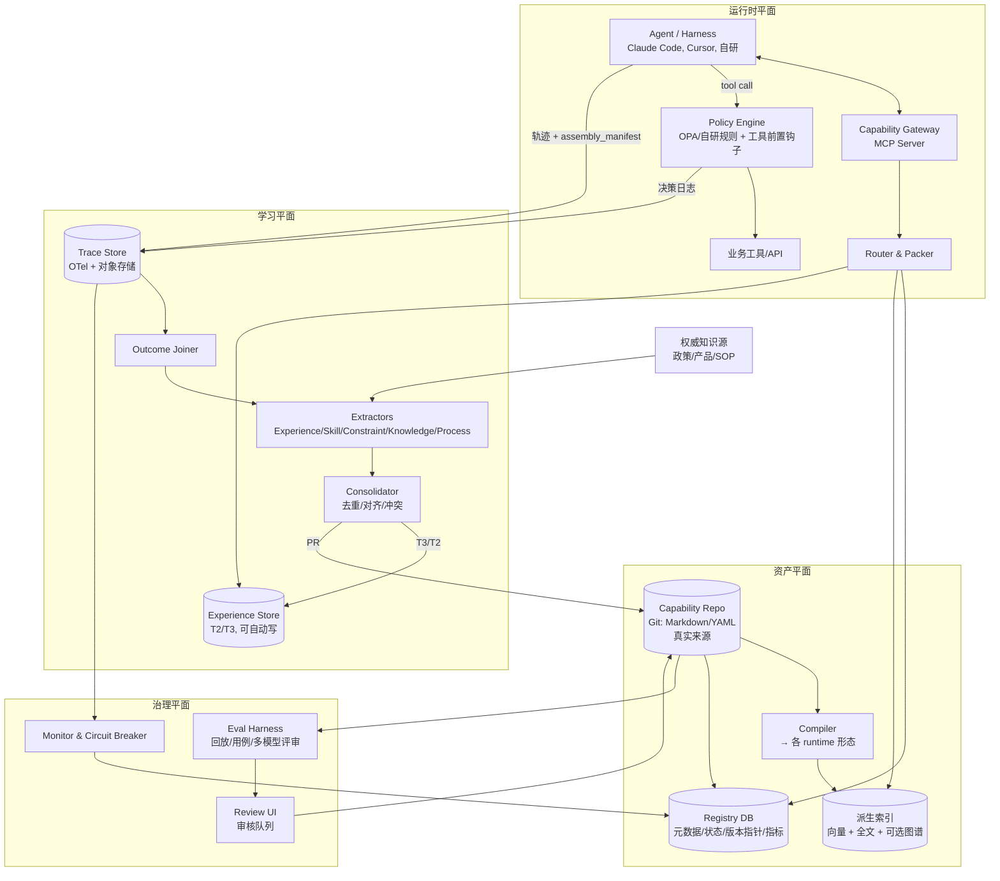

# 业务能力资产化方案：从 Agent 运行轨迹中提取、验证、装配和演化业务能力

先说结论。我建议把业务能力当成**软件资产**来管，而不是当成记忆来管：

- 以 Git 仓库里的 Markdown/YAML 能力包作为唯一的真实来源（source of truth）。
- 向量库、图库、全文索引都只是可重建的派生索引。
- 自动抽取只产出候选项，候选项必须过评测门控和分级人工审核，才能晋升为正式能力。
- 约束要尽量编译成 Agent 之外的可执行策略（policy），不能只写进 prompt。

> **核实说明**：四个参考项目的 README 我已拉取原文核对，下文对它们的描述以 README 为准。Mem0、Zep/Graphiti、Letta、LangMem、Cognee、Agent Skills 规范等来自我已有的知识，本次没有逐一复核，采用前请以官方文档为准。

---

## 0. 显式假设

1. **业务形态**：以 B2B/B2C 服务类业务为例，比如电商售后退款审核（与 tau2-bench 的 retail 场景同构）。流程可以描述，有明确的合规规则，有工具 API（订单查询、退款执行、工单）。
2. **Agent 形态**：一个或多个 LLM Agent，通过 MCP 或函数调用使用工具。运行时可能是 Claude Code / Cursor 这类通用 harness，也可能是自研编排器。
3. **团队规模**：2–4 名工程师，1–2 名业务专家（SME）兼职做审核。
4. **合规等级**：中等。有 PII（个人身份信息）和资金操作，需要审计，但不是医疗或金融强监管。
5. **可观测性**：可以拿到完整轨迹，包括消息、工具调用的入参和出参、最终结果，以及人工评价或事后业务结果（比如退款是否被申诉）。
6. **多租户**：同一套能力要服务多个业务线或客户，需要作用域隔离和继承。

---

## 1. 问题定义

### 1.1 什么叫「业务能力提取」

**业务能力提取**，是把 Agent（以及人类专家）完成某类业务任务时体现出来的「怎么做、什么不能做、依据什么、踩过什么坑」，从零散的对话、轨迹、文档中抽离出来，沉淀成满足下面四个条件的资产：

- **可寻址**：有 ID、URI 和版本。
- **可验证**：有来源证据，有评测用例。
- **可装配**：运行时能按任务按需加载到任意 Agent 或 runtime。
- **可治理**：有 owner、审批、过期、回滚。

判断标准：**把这个能力包拿掉，换一个新 Agent 或新模型装上它，业务表现能否复现。**能复现的是资产，不能复现的只是记忆。

### 1.2 与相邻方案的边界

| 方案 | 解决什么 | 缺什么（为什么不够） |
|---|---|---|
| 纯 prompt / system prompt | 把规则写死在一处 | 不可组合，不可按需加载，没有版本和证据，越写越长直到失效 |
| 纯 RAG | 事实性知识的检索 | 只能回答「是什么」，不能回答「怎么做 / 何时停 / 不许做什么」；检索命中不等于会执行 |
| 纯 memory（Mem0/Zep 类） | 跨会话记住用户和事件 | 以个人或会话为中心，写入门槛低，缺审核；内容是「发生过什么」，不是「应该怎么做」 |
| 微调 | 把行为固化进权重 | 不可审计，不可局部回滚，更新周期长；适合最后把稳定能力蒸馏进去，不适合作为主载体 |
| **业务能力资产（本方案）** | 可复用、可治理的「怎么做」 | 构建成本较高，需要策展流程 |

### 1.3 个人助手记忆 vs 可复用业务能力资产

| 维度 | 个人助手记忆 | 业务能力资产 |
|---|---|---|
| 主体 | 某个用户或会话 | 某个业务域 / 租户 / 组织 |
| 写入者 | Agent 自动写 | 自动写候选，人或门控晋升 |
| 典型内容 | 偏好、历史事件、上下文 | 技能、流程、约束、领域知识、经验教训 |
| 错误代价 | 体验变差 | 资损、合规事故、批量错误 |
| 生命周期 | 衰减 / 遗忘 | 版本化、弃用、归档 |
| 存储 | 向量/图库即可 | Git（真实来源）+ 派生索引 |
| 可移植性 | 跟用户走 | 跟业务走，跨 Agent 和模型 |

**原则**：两者物理隔离。个人记忆可以成为经验抽取的**输入**，但永远不直接成为能力资产；必须经过去标识化、聚合和晋升。

---

## 2. 能力本体（Ontology）

五类能力加两类支撑对象（证据、评测）。核心设计点是：**每一类有不同的信任级别和演化权限。**

### 2.1 五类能力

| 类型 | 定义 | 粒度 | 存储形态 | 可自动演化程度 | 典型例子 |
|---|---|---|---|---|---|
| **Skill 技能** | 完成一个可命名子任务的方法：输入/输出契约、步骤、工具用法、示例 | 一个「动词 + 对象」，如「核验退款资格」；执行 1–15 步 | `SKILL.md`（frontmatter + 正文）+ 可选脚本或模板 | 中：正文措辞和示例可自动提议，契约变更需人审 | `verify-refund-eligibility` |
| **Process 流程** | 多个技能按状态和条件编排成的端到端业务流程，含分支、人工节点、SLA | 一个业务事件的全流程，如「售后退款」 | **结构化状态机**（YAML/JSON，可编译成 LangGraph/Temporal 或 harness 的 plan），附人类可读说明 | 低：结构变更必须人审 | `refund-handling.v3` |
| **Constraint 约束** | 必须或禁止的规则，含适用条件、严重级别、执行方式 | 一条可判定的规则 | YAML 规则 + **可执行形态**（OPA/Rego、JSON Schema、工具前置钩子、正则/分类器） | **极低**：只能人工新增或放宽；自动系统只能提议收紧或报告冲突 | 「单笔退款 > ¥2000 必须人工审批」 |
| **Knowledge 知识** | 业务事实：政策文本、产品参数、术语、实体关系 | 文档块、实体、关系三元组（带有效期） | 原文档（Markdown）+ 块索引 + 可选时态知识图 | 高（同步类）：从权威源自动同步，冲突时告警 | 退货政策 2026-Q3 版、SKU 保修期 |
| **Experience 经验** | 从具体案例中归纳的启发式与教训：「在 X 情况下，Y 做法有效/失败」 | 一条「情境 → 做法 → 结果 → 证据」 | 案例卡片（Markdown + 结构化字段），聚类后形成模式 | **高**：可自动写入，但默认处于低信任层，需累积证据才能升级 | 「用户说『没收到』时先查物流签收照片，比直接退款的申诉率低 40%」 |

### 2.2 支撑对象

- **Evidence 证据**：轨迹片段 ID、工单 ID、文档版本、人工反馈，是每个能力条目的必填外键。**没有证据的条目不能晋升。**
- **EvalCase 评测用例**：输入场景、期望行为或断言、判定方式。每个 Skill、Process、Constraint 至少绑定 N 条。

### 2.3 类型之间的关系



**关键的晋升路径**：Experience 是唯一的「自动入口」。它累积到阈值后，被提议升级为 Skill 的一个步骤或示例、一条 Constraint 草案、或 Process 的一个分支。晋升一律走门控。

### 2.4 生命周期状态机（所有类型通用）

```
candidate → shadow → active → deprecated → archived
     ↘ rejected        ↘ suspended（自动熔断）→ active / deprecated
```

各状态的含义：

- **candidate**：抽取或人工起草，尚未评测。
- **shadow**：影子模式，运行时注入但不影响决策；或只在 A/B 的对照流量上生效，用于收集指标。
- **active**：正式生效。
- **suspended**：线上指标恶化，被自动熔断。**这是自动系统唯一可以执行的「降级」动作。**
- **deprecated**：已被新版本取代，保留可回滚。

### 2.5 信任级别（trust tier）

| Tier | 来源 | 运行时权重 | 例子 |
|---|---|---|---|
| T0 权威 | 法务/业务 owner 签发 | 强制；冲突时总是赢 | 合规约束、官方政策 |
| T1 已验证 | 过评测 + 人工审核 | 默认注入 | 正式技能、流程 |
| T2 统计支持 | 自动晋升（证据数 ≥ N，指标显著） | 作为「建议」注入，标注置信度 | 经验模式 |
| T3 候选 | 单次抽取 | 不注入，或只在影子模式注入 | 新抽取的经验 |

---

## 3. 抽取管线

### 3.1 输入源与信号强度

| 输入 | 能抽出什么 | 信号质量 |
|---|---|---|
| 成功任务的轨迹（带业务结果确认） | Skill 步骤、工具用法、示例 | 中；成功不等于做对，要看事后结果 |
| 失败任务的轨迹（报错、用户投诉、人工接管） | Experience（反例）、Constraint 缺口 | **高**；失败最有信息量 |
| 人工接管或纠正（human-in-the-loop 的 diff） | 高价值 Experience、Skill 修订 | **最高**；专家的纠正动作就是标注 |
| 工具调用日志（入参 → 错误码） | 工具使用约束（参数前置条件） | 高，而且可以自动验证 |
| 政策/产品文档、SOP、工单系统 | Knowledge、Process 骨架、Constraint 草案 | T0 来源，但需要结构化 |
| SME 访谈 | Process、Constraint、隐性知识 | 高，但昂贵；用 Ouroboros 式「苏格拉底访谈 + 模糊度评分」提效 |

### 3.2 管线分层



### 3.3 各抽取器的具体做法

**轨迹分段（segmentation）**：按工具调用边界和 LLM 自报的子目标切分；或让一个便宜模型给每一步打「子目标标签」。输出 episode = {goal, steps[], outcome, cost}。

**Experience 抽取**：对每个带结果的 episode，用 LLM 填固定 schema：

```yaml
situation: "用户声称未收到货，物流显示已签收"
action_taken: "先调用 get_delivery_proof 获取签收照片并发给用户"
outcome: "用户确认家人代收，未退款；无申诉"
outcome_label: success      # 来自 Outcome Join，不是 LLM 自评
counterfactual_hint: "对照组直接退款的 30 天申诉率 12%"
evidence: [trace:abc123#step4-9, ticket:T-8812]
```

硬性规则：`outcome_label` **必须来自外部信号**（业务结果、人工评价），不能用 LLM 自评。自评只能作为 T3 的弱信号。

**Skill 抽取**有两条路：

1. **频繁子序列挖掘**：在成功 episode 里找反复出现的「工具调用序列 + 参数模式」，例如 `get_order → check_return_window → get_delivery_proof`。支持度超过阈值就生成技能草案。
2. **纠正驱动**：人工接管后的正确做法与 Agent 原做法做 diff，diff 就是技能修订提案。

输出为 Agent Skills 规范风格的 `SKILL.md`，包括 name、description（用于路由）、前置条件、步骤、工具、示例、反例。

**Constraint 缺口检测**的触发条件有三类：工具报错（参数非法、权限拒绝）、人工否决、事后违规（资损、投诉）。产出**草案**，内容包括规则的自然语言、建议的可执行形态，以及它若存在本可拦截的历史轨迹列表。这份列表就是回放证据。

**Knowledge 结构化**：权威文档走同步管道，文档变化时生成新版本，并对**引用了旧版本的 Skill/Constraint 自动触发复审任务**。实体关系抽取可以选配时态图，给每条事实记 `valid_from/valid_to`，这一点借鉴 Graphiti 的双时态思路。

**Process 骨架**：SOP 文档加上高频成功轨迹的路径聚类，生成状态机草案。流程**只做草案，不自动生效**。

### 3.4 归并

所有候选先与现有资产做语义近邻匹配（embedding 加关键字段比对），然后归入四类：

- **重复**：合并证据，只加计数，不新建条目。
- **修订**：生成对现有条目的 diff PR。
- **新增**：新建条目。
- **冲突**：与 active 资产矛盾，进入人工队列并高优先级处理。**冲突本身就是最有价值的产出。**

---

## 4. 验证与门控

### 4.1 三种主要风险与对策

| 风险 | 表现 | 对策 |
|---|---|---|
| **幻觉技能** | LLM 从一次偶然成功中归纳出「通用方法」；或编造不存在的工具参数 | ①证据门槛：支持度 ≥ N 条独立轨迹，且 outcome 来自外部信号；②**静态校验**：技能引用的工具名和参数必须能在工具 schema 注册表里解析；③回放评测 |
| **过时知识** | 政策改了，技能还在按旧政策执行 | ①每个条目记录 `depends_on`（依赖的知识版本）；②知识版本变更时，依赖方自动降到「待复审」；③设 TTL / `review_by` 日期，到期没复审就降级为 T2 |
| **有害约束** | 自动生成的约束过严（拒绝合理请求）、过松（放行违规）或彼此冲突 | ①约束只允许人工新增或放宽；②**历史回放**：新约束在过去 30 天的轨迹上跑一遍，报告「会拦截多少、其中多少是误拦」；③冲突检测：约束集合做可满足性检查（Rego 测试或 SMT，简单场景用规则对比） |

### 4.2 分阶段门控

借鉴 Ouroboros 的三段式评测（Mechanical → Semantic → Consensus），并改造成适合能力资产的形式：

```
Stage 0  结构校验 (免费, CI)
  - schema 合法、必填字段、证据链接可解析
  - 工具引用可解析, 知识依赖版本存在
  - 约束的可执行形态能通过自带单测
Stage 1  离线评测 (便宜)
  - 绑定 EvalCase 通过率 ≥ 阈值
  - 全量回归集不退化 (其它技能的用例不能挂)
  - 约束: 历史回放的拦截率/误拦率报告
Stage 2  语义审查 (LLM-as-judge, 多模型)
  - 与 T0 约束是否矛盾; 描述是否与步骤一致; 是否过拟合单一案例
  - 用 ≥2 个不同厂商模型, 分歧即升级人工
Stage 3  人工审核 (按类型和风险分级, 见 4.4)
Stage 4  影子/金丝雀 (线上)
  - shadow: 注入但记录"若采用会怎样"; 或 5% 流量 A/B
  - 达到样本量且主指标不劣化才转 active
```

### 4.3 评估指标

**资产级（每个条目）**：

- **命中率**：被检索到的次数。
- **采用率**：被检索到之后，Agent 实际遵循的比例。通过轨迹与技能步骤的对齐度判定。
- **遵循后成功率 vs 未遵循成功率**：这是**因果增益**的粗估，也是最重要的指标。
- **约束**：拦截数、误拦率（人工申诉推翻率）、漏拦（事后违规中本应被拦截的比例）。
- **新鲜度**：距上次复审的天数、依赖知识是否最新。

**系统级（每个业务域）**：

- 任务成功率，以外部结果为准，而非 LLM 自报。
- 人工接管率、平均处理时长、单任务 token 成本。
- 合规事故数（硬指标，目标为 0）。
- 装配效率：注入的 token 数，以及注入内容被实际使用的比例。

**抽取管线本身**：

- 候选晋升率：太高说明门槛太松，太低说明抽取器噪声大。
- 审核队列时长。
- 人工驳回原因分布，用来反向改进抽取 prompt。

### 4.4 人工策展 vs 自动演化

| 动作 | Skill | Process | Constraint | Knowledge | Experience |
|---|---|---|---|---|---|
| 新建 candidate | 自动 | 自动（草案） | 自动（草案） | 自动同步 | 自动 |
| candidate → shadow | 自动（过 Stage 0–2） | **人工** | **人工** | 自动（权威源） | 自动 |
| → active | 人工 | 人工（业务 owner） | **人工（owner + 合规）** | 自动（权威源）/ 人工（非权威源） | 自动晋升到 T2（证据 ≥ N 且增益显著） |
| 措辞 / 示例微调 | 自动（过回归） | 人工 | 人工 | — | 自动 |
| 放宽 | 人工 | 人工 | **仅限人工** | — | — |
| 收紧 / 熔断 | 自动熔断 | 自动熔断 | 自动提议，人工确认 | 自动标记冲突 | 自动降级 |
| 删除 / 归档 | 人工 | 人工 | 人工 | 自动（源已删） | 自动（衰减） |

一句话概括：**自动系统可以让能力「变少、变弱、变待审」，不能让能力「变多、变强、变宽松」。**唯一的例外是 T2 经验层，它只以「建议」身份注入。

---

## 5. 运行时装配（context packing）

### 5.1 装配顺序：确定性优先，语义检索兜底



### 5.2 注入分层

这里借鉴 OpenViking 的 L0/L1/L2 分层和 Agent Skills 的渐进披露（progressive disclosure）：

| 层 | 内容 | 注入方式 | 预算建议 |
|---|---|---|---|
| **必载** | 当前 Process 节点说明、T0 约束的**自然语言摘要** | system 段固定注入 | ≤ 1.5k tokens |
| **目录** | 本节点可用技能的 name + 一句 description（L0） | 列表注入；Agent 按需调用 `load_skill(id)` 拉取全文 | 每个技能约 30 tokens |
| **按需** | 技能全文（L2）、知识原文块 | 工具调用返回 | 单次 ≤ 4k |
| **建议** | Top-k（k ≤ 3）T2 经验，标注置信度和证据数 | 放在「参考经验」段，明确写「可不采纳」 | ≤ 800 |

### 5.3 组合与冲突解决

- **作用域继承**：`global → org → business_line → process → node`，采用下层覆盖上层的规则。**T0 约束不可被下层覆盖。**
- **优先级**：T0 约束 > Process 节点指令 > T1 技能 > T2 经验 > 用户临时指令（涉及约束的部分）。
- **约束双通道**：
  - prompt 里放摘要，让 Agent 知道边界、少走弯路；
  - **真正的执行在 Policy Engine**，也就是工具调用前的钩子（MCP 网关 / harness hooks）。prompt 只是提示，钩子才是闸门。
- **可追溯**：每次装配生成 `assembly_manifest`，记录注入的能力 ID、版本、分数和 token 数，随轨迹落库。这是后续因果评估和回滚分析的基础。

### 5.4 跨 runtime 分发

能力包用**中立格式**存储。发布时由「编译器」生成各 runtime 的形态：

- Claude Code / Cursor：`SKILL.md` + rules 文件 + hooks 配置。
- 自研编排器：Process YAML → LangGraph/Temporal 定义。
- 通用 Agent：MCP server 暴露 `list_skills / load_skill / search_knowledge / check_policy`。

这样模型或 harness 换代时，能力资产不需要重写。

---

## 6. 演化机制

### 6.1 三个演化回路



### 6.2 版本化

- **Git 即真实来源**。每个能力是一个目录，每次变更是一个 PR。PR 描述由机器生成，包括证据、评测结果和回放报告。人审就是 code review。
- **语义化版本**：
  - major：契约或结构变化（输入/输出、流程节点）；
  - minor：新增步骤、示例或分支；
  - patch：措辞修改。
- **发布快照**：一个业务域的全部 active 资产打一个 release（例如 `refund-domain@2026.09.25-1`），运行时按 release 锁定，不按单条目漂移。这样线上行为可以复现。
- **轨迹绑定版本**：每条轨迹记录所用的 release 和条目版本。

### 6.3 回滚

- **单条目回滚**：把条目指针切回上一版本（`active_version`），不需要重建索引，因为索引按版本存储。
- **整域回滚**：运行时 release 指针切回上一个快照，目标是秒级生效。
- **自动熔断**：条目级指标（遵循后成功率、误拦率）在滑动窗口内显著劣化，就自动切到 `suspended`，回退上一 active 版本并告警。
- **防振荡**：同一条目 7 天内被熔断 2 次就冻结自动演化，强制人工处理。这借鉴了 Ouroboros 的停滞/振荡检测与硬上限思路。

### 6.4 演化预算

每个域每周设定：

- 自动 PR 上限（例如 20 个），防止审核者被淹没；
- 抽取与评测的 LLM 成本上限；
- 影子流量比例上限。

预算耗尽时，按「冲突 > 失败驱动 > 高频」的优先级排队。

---

## 7. 架构蓝图

### 7.1 模块图



### 7.2 数据模型草图

**能力包目录（Git）**：

```
capabilities/
  domains/refund/
    domain.yaml                 # owner, 作用域, release 策略
    processes/refund-handling/
      process.yaml              # 状态机
      README.md
    skills/verify-refund-eligibility/
      SKILL.md                  # frontmatter + 正文
      evals/*.yaml
      scripts/                  # 可选
    constraints/
      high-value-approval.yaml
      high-value-approval.rego
      high-value-approval_test.rego
    knowledge/
      return-policy/2026-q3.md  # 或指向权威源的引用
    experience/                 # 仅 T2 已晋升的模式快照(导出), T3 不入库
```

**`SKILL.md` frontmatter**：

```yaml
---
id: skill.refund.verify-eligibility
name: verify-refund-eligibility
description: 在执行任何退款前核验订单是否在退货窗口内、商品类别是否可退、是否已有进行中的售后单
version: 2.3.0
status: active
trust_tier: T1
scope: { org: acme, business_line: ecommerce, process: refund-handling }
owner: team-aftersales
tools: [get_order, get_return_policy, list_aftersales_tickets]
depends_on:
  - knowledge.refund.return-policy@2026-q3
constraints: [constraint.refund.high-value-approval]
evals: [evals/basic.yaml, evals/edge-bundle-orders.yaml]
evidence_count: 142
review_by: 2026-12-31
---
```

**Constraint**：

```yaml
id: constraint.refund.high-value-approval
statement: 单笔退款金额 > 2000 CNY 时，必须创建人工审批并等待通过，不得直接调用 execute_refund
severity: block            # block | require_approval | warn
applies_to: { tools: [execute_refund] }
enforcement:
  engine: opa
  policy: high-value-approval.rego
trust_tier: T0
owner: compliance
source: { doc: "财务制度 FIN-012 §3.2", version: "2026-07" }
change_policy: human_only
```

**Registry 表**（Postgres）：

```sql
capability(id, type, domain, scope_path, active_version, status, trust_tier, owner, review_by)
capability_version(id, version, git_sha, content_hash, created_at, created_by, change_kind)
evidence(capability_id, version, source_type, source_ref, outcome_label, weight)
eval_run(id, capability_id, version, suite, pass_rate, regression_delta, judge_models, created_at)
assembly_log(trace_id, release_id, capability_id, version, layer, tokens, retrieved_score, followed bool)
metric_window(capability_id, version, window, hits, adoption, success_followed, success_not_followed, false_block_rate)
review_task(id, capability_id, kind, priority, assignee, status, reason)
release(id, domain, manifest jsonb, created_at, is_current)
```

**Experience**（可自动写，放在专用存储里）：

```sql
experience(id, domain, scope_path, situation, action, outcome_label, embedding,
           cluster_id, evidence_refs[], support_count, tier, decay_score, created_at)
```

### 7.3 API / 接口面

**运行时（MCP tools，暴露给 Agent）**：

| 接口 | 说明 |
|---|---|
| `capability.plan(task, context) → {process, node, skills_catalog, constraints_summary, manifest_id}` | 由 Router 调用或作为首个工具 |
| `skill.load(id, version?) → SKILL body` | 渐进披露 |
| `knowledge.search(query, scope?, as_of?) → chunks[]` | 限定作用域，支持时点查询 |
| `experience.suggest(situation, k=3) → items[] (含置信度/证据数)` | |
| `policy.check(tool, args, context) → allow/deny/require_approval + reason` | 同时以 pre-tool hook 形式强制执行 |
| `feedback.report(trace_id, capability_id, signal)` | Agent 或人工显式反馈 |

**管理面（REST/gRPC，内部）**：

- `POST /candidates`：抽取器提交，自动生成 PR。
- `POST /eval/run {capability_id, version, suites}`
- `POST /replay {constraint_id, window}`：历史回放。
- `POST /promote`、`POST /rollback {id, to_version}`、`POST /release/{domain}/pin`
- `GET /capability/{id}/lineage`：证据、版本、指标全链路。

---

## 8. 落地路径

### 8.1 分阶段计划

| 阶段 | 时长 | 目标 | 交付物 | 退出标准 |
|---|---|---|---|---|
| **P0 奠基** | 2 周 | 能看到数据、能手写资产 | Trace Schema + 采集；能力仓库骨架与 schema；CI 结构校验；**把现有 SOP/规则手工整理成 5–10 个 Skill、全部 T0 约束、1 个 Process** | 一个业务流程的轨迹 100% 可追溯 |
| **P1 MVP 装配** | 3–4 周 | 手工资产在线上产生价值 | Capability Gateway（MCP）；Router（规则版）；分层打包；**Policy Engine 接管高风险工具**；`assembly_log`；离线 EvalCase ≥ 50 条 | 相对基线：成功率不降、合规事故 0、token 成本持平或下降 |
| **P2 自动抽取** | 4–6 周 | 从轨迹里产候选 | Outcome Joiner；Experience 抽取器 + T3/T2 存储；Constraint 缺口检测；Consolidator；机器生成 PR；审核 UI（可先用 GitHub PR） | 每周产出 ≥ 10 个可审候选，驳回率 < 60% |
| **P3 门控与演化** | 4–6 周 | 闭环 | 回放评测；多模型评审；shadow/金丝雀；指标窗口 + 自动熔断；release 快照与回滚 | 演示一次「自动熔断 → 回滚 → 修复 → 重新晋升」全流程 |
| **P4 规模化** | 持续 | 多域、多租户、多 runtime | 作用域继承；编译器输出多 runtime；知识依赖复审；演化预算；可选蒸馏 | 第二个业务域用同一平台上线时间 < 2 周 |

### 8.2 技术选型建议

| 组件 | 推荐 | 理由 |
|---|---|---|
| 真实来源 | **Git + Markdown/YAML** | 可 diff、可审查、可回滚；审核流程复用 code review |
| 能力格式 | **Agent Skills 规范风格的 `SKILL.md`** + 自定义 frontmatter 扩展 | 事实标准，跨 Claude Code / Cursor 等可直接使用 |
| 约束执行 | **OPA/Rego**（或规则简单时用自研 JSON 规则）+ MCP 网关 / harness pre-tool hooks | 约束必须在 LLM 之外可执行、可单测 |
| 流程编排 | 自研编排器用 **LangGraph** 或 **Temporal**；通用 harness 用「Process → plan 模板 + 节点状态工具」 | 流程要可观测、可恢复 |
| 轨迹 | **OpenTelemetry GenAI 语义约定** + Langfuse/Phoenix 类平台 + 对象存储 | 标准化，方便回放 |
| 索引 | Postgres + pgvector + 全文（或 SQLite FTS5 + LanceDB 做本地版） | 足够用，运维简单；索引可随时从 Git 重建 |
| 时态知识图（可选） | **Graphiti/Zep** 思路 | 只在实体关系和有效期很关键时才引入 |
| 评测 | 自研 eval harness（pytest 风格）+ promptfoo/DeepEval 类工具 | 用例跟资产放在同一仓库 |

### 8.3 开源项目在方案中的角色

| 项目 | 角色 | 用哪部分 / 为什么 |
|---|---|---|
| **OpenViking**（AGPLv3） | **借鉴思路；可在 Experience/Knowledge 层选择性采用** | ① `viking://` 虚拟文件系统和目录作用域检索，对应本方案的 scope_path 与「在子树内检索」；② **L0/L1/L2 分层摘要**，直接对应分层注入；③ 会话提交后抽取的记忆是可编辑的 Markdown，与「可审查」理念一致；④ README 报告 tau2-bench 上经验记忆带来 +6.87pp（retail）/ +11.87pp（airline），说明经验层有实际增益，这是我们设 T2 层的依据。**注意 AGPLv3**：作为内部服务自托管问题不大，要嵌入分发的产品就需要法务评估。它不负责治理，也就是没有「晋升门控、约束执行」，所以不能作为资产真实来源 |
| **Ouroboros**（MIT） | **借鉴思路（门控与演化控制）** | ① **访谈门控 + 模糊度评分（ambiguity ≤ 0.2）**，用于 SME 访谈抽取 Process/Constraint，模糊度不达标就不生成草案；② **三段式评测 Mechanical → Semantic → Consensus**，直接改造为本方案的 Stage 0–2；③ 不可变 Seed 规格，对应 release 快照的不可变性；④ **有预算的演化循环 + 停滞/振荡检测 + 代数硬上限**，对应演化预算与防振荡；⑤ 事件溯源（event sourcing）持久化，对应轨迹和 lineage。它面向 AI 编码工作流，**不适合直接当业务能力存储** |
| **MemOS**（Apache-2.0） | **借鉴思路；可在经验层直接采用本地插件或服务** | ① **Memory Cube**（多知识库隔离、受控共享、动态组合）对应作用域继承与多租户；② 本地插件的 **L1 traces → L2 policies → L3 world model → crystallized Skills** 分层，与本方案「经验 → 模式 → 技能」的晋升路径同构，是很好的参照实现；③ 反馈纠错 API 对应 `feedback.report`；④ MemScheduler 异步写入。短板：自托管依赖 Neo4j + Qdrant，偏重；技能「结晶」是自动的，**必须在它外面再套我们的门控**，不能让它直接写 active 资产 |
| **EverOS**（Apache-2.0） | **借鉴思路最多；小团队可直接作为经验/知识层起点** | ① **Markdown 作为真实来源 + SQLite/LanceDB 派生索引**，与本方案核心立场完全一致；② **用户轨道（episodes/profile）与 Agent 轨道（cases/skills）分离**，正对应「个人记忆 vs 业务资产」隔离；③ 按 user/agent/app/project/session 正交检索，对应作用域；④ 离线 Reflection（合并 episode 聚类、精炼技能），对应中回路；⑤ Knowledge Wiki。生态里的 SkillCorpus 和 EvoAgentBench 可以作为技能检索与自演化评测的参考基准。短板：定位是记忆层，**没有约束执行和审核流程** |
| Mem0 | 不适合作为资产层 | 面向个人/用户记忆，写入门槛低；可以作为个人助手记忆部分的实现 |
| Zep / Graphiti | 借鉴（时态知识） | 双时态事实与有效期，适合 Knowledge 层中「政策随时间变化」的部分 |
| Letta / MemGPT | 借鉴（上下文分层管理） | core/archival 分层与自编辑记忆的思想；自编辑不适用于业务资产 |
| LangMem | 借鉴（程序性记忆优化） | 基于反馈的 prompt/指令优化思路，可用于 Skill 措辞的自动 patch 级优化，但必须过回归评测 |
| Cognee | 可选 | 文档 → 知识图的 ECL 管线，可用于 Knowledge 结构化 |
| Agent Skills 规范 / Cursor rules & skills | **直接采用（分发格式）** | 作为编译器的输出目标，保证跨 runtime 可用 |

---

## 9. 风险与反模式

1. **把向量库当真实来源**：出了问题无法 diff、无法审查、无法回滚。**对策**：Git 为真实来源，索引可删可重建。
2. **约束只写在 prompt 里**：模型总会在某次绕过。**对策**：高风险约束必须有可执行形态，并在工具网关强制执行；prompt 里只放摘要。
3. **用 LLM 自评做结果标签**：自我强化的幻觉闭环，「我觉得我做对了」被沉淀成技能。**对策**：outcome 必须来自外部信号。
4. **自动系统能放宽约束**：一次误归纳就可能导致批量违规。**对策**：放宽与新增约束只能人工完成。
5. **技能粒度失控**：太粗就成了一个巨型 SOP 塞进上下文，太细就成了几百个碎片技能，路由混乱。**对策**：一个技能对应「一个动词 + 对象、1–15 步」；目录注入只放描述；定期合并低命中技能。
6. **审核队列被淹没**：抽取器太积极，SME 开始无脑批准。**对策**：演化预算；驳回原因反馈给抽取器；按风险分级只让人看高风险条目。
7. **个人记忆泄漏进业务资产**：PII 或个别用户偏好被当成通用规则。**对策**：去标识化；「独立用户数 ≥ M」才能晋升；物理隔离存储。
8. **知识更新了，技能还在引用旧版**。**对策**：`depends_on` + 变更触发复审 + `review_by` 过期降级。
9. **只看命中率，不看因果增益**：被检索多不代表有用。**对策**：追踪「遵循 vs 不遵循」的成功率差，必要时做 A/B。
10. **绑死某个 runtime 格式**：模型或 harness 换代时要重写。**对策**：中立格式加编译器。
11. **过早上图数据库或微调**：复杂度远超收益。**对策**：P3 之前不引入，除非有明确的实体关系查询需求。
12. **演化振荡**：A/B 两版来回切换。**对策**：防振荡冻结与冷却期。

---

## 10. 一页执行清单（下周开工）

**负责人**：E1 平台工程，E2 Agent 工程，E3 数据/评测，SME 业务专家。

| # | 任务 | 负责人 | 产出 / 验收 |
|---|---|---|---|
| 1 | 选定首个业务流程（建议：高频、规则清晰、有外部结果信号，例如退款审核），写一页范围说明和成功指标基线 | SME + E2 | 基线数据：成功率、接管率、单任务成本 |
| 2 | 建能力仓库 `capabilities/`，定义 Skill/Constraint/Process/Knowledge 的 JSON Schema，并加 CI 结构校验 | E1 | PR 合并时 schema 校验会阻断不合规提交 |
| 3 | 轨迹采集：接入 OTel GenAI 语义，记录消息、工具调用、结果；定义 `trace_id` 与 `assembly_manifest` 字段 | E1 | 首个流程的 100% 会话可查 |
| 4 | Outcome Join 设计：确定外部结果信号来源（申诉、退单、CSAT、人工接管）及关联键 | E3 | 字段映射文档 + 一个关联 SQL |
| 5 | 与 SME 做 2 场访谈（每场 90 分钟），用「模糊度检查表」（目标 / 约束 / 成功标准是否明确）逼出隐性规则 | SME + E2 | 一份 Process 草案 + 全部 T0 约束清单 |
| 6 | 手写 5–10 个 `SKILL.md`，每个至少 5 条 EvalCase | E2 + SME | 离线评测可跑 |
| 7 | 把 3 条最高风险约束写成 Rego + 单测，挂到退款等资金类工具的 pre-tool hook 上 | E1 | 违规调用在测试环境被 100% 拦截 |
| 8 | Capability Gateway 最小版（MCP）：`capability.plan`、`skill.load`、`policy.check` 三个接口 | E1 | Agent 能在一次会话里按需加载技能 |
| 9 | 离线 eval harness：跑全部 EvalCase，输出通过率与回归 diff，并接入 CI | E3 | 每个 PR 自动出评测报告 |
| 10 | 搭一个 EverOS（或 MemOS 本地插件）实例做 Experience 原型，**只读回灌历史轨迹，不接线上**，评估抽取质量 | E3 | 抽样 50 条经验，人工标注可用率 |
| 11 | 写 ADR：「能力资产以 Git 为真实来源，自动系统只能收紧不能放宽」 | E1 | `docs/adr/` 新增并评审通过 |
| 12 | 周五评审：基线 vs 手工资产装配后的离线评测结果，决定 P1 范围 | 全员 | Go / No-Go 结论 |

---

## 核心立场

- **资产不是记忆**：业务能力以 Git 中的 Markdown/YAML 为唯一真实来源，向量、图、全文都只是可重建的派生索引。个人记忆与业务资产物理隔离，前者只能作为后者的抽取输入。
- **自动化只负责提议和刹车**：抽取管线只产候选（PR）和低信任经验（T2/T3）。自动系统可以让能力变少、变弱、变待审（熔断、降级、标记冲突），不能让能力变多、变强、变宽松。新增和放宽约束、流程结构变更必须人审。
- **约束是代码，不是 prompt**：高风险约束编译成 Policy Engine 规则，在工具网关强制执行，并能在历史轨迹上回放验证。prompt 里只放摘要，帮 Agent 少走弯路。
- **装配先走确定性路由，再做语义检索**：先按流程和节点确定性选出技能和约束，再在作用域子树内语义检索知识与经验。全程按 L0/L1/L2 分层、渐进披露；每次装配都留 manifest，用来做因果评估和回滚分析。
- **开源项目借思路，不当地基**：EverOS/OpenViking 的 Markdown 真实来源与分层上下文、MemOS 的 Cube 隔离与「轨迹 → 策略 → 技能」分层、Ouroboros 的分阶段评测门控与有预算的演化，都值得吸收；但它们都不提供业务级的审核、约束执行和发布治理。这一层必须自建，而且要做得很薄：主要就是 Git、CI、OPA 和一个注册表。

I now have enough verified details on both projects to write the full proposal in Chinese, covering OpenViking's architecture and benchmarks alongside Ouroboros's licensing and evaluation approach.

For MemOS, I'm noting its memory cube isolation model, self-hosted graph/vector storage, and layered plugin traces/policies/world model with crystallized skills. For EverOS, I'm cataloging its Markdown-as-source-of-truth design, dual-store setup, and separation of user versus agent memory scopes with offline reflection.

I'm also recalling other relevant systems from my existing knowledge—Mem0, Zep/Graphiti, Letta, LangMem, Cognee, and the Agent Skills spec—though I should flag these as not independently re-verified this session. My overall stance is forming around treating Git as the source-of-truth capability package, compiled into an index, where automated extraction only yields candidates pending promotion.

Promotion should require an evaluation gate plus human review, especially for constraints and processes, with runtime assembly handled by a deterministic router using progressive disclosure. Constraints need enforcement outside the LLM itself—through policy engines or hooks—rather than relying solely on prompting, and processes should be modeled as explicit state machines or workflow definitions rather than prose descriptions. I'm deciding that experience should be the only layer allowed to auto-evolve, and even then only at a low trust tier.

I want to write this up thoroughly and organized, with mermaid diagrams, a data model in YAML/SQL, and an API surface, plus clearly listed assumptions. I'll ground it in a concrete business example—something like a customer-support refund or insurance claims workflow—using a running example of enterprise after-sales refund review, which maps well to tau2-bench retail scenarios. Since no file write was requested, I'll produce the full answer directly in my response, even if it ends up being long.

